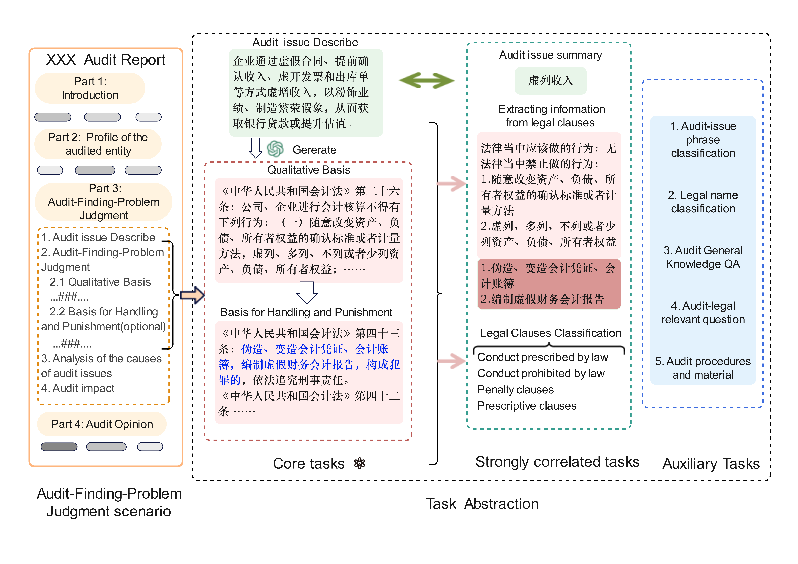
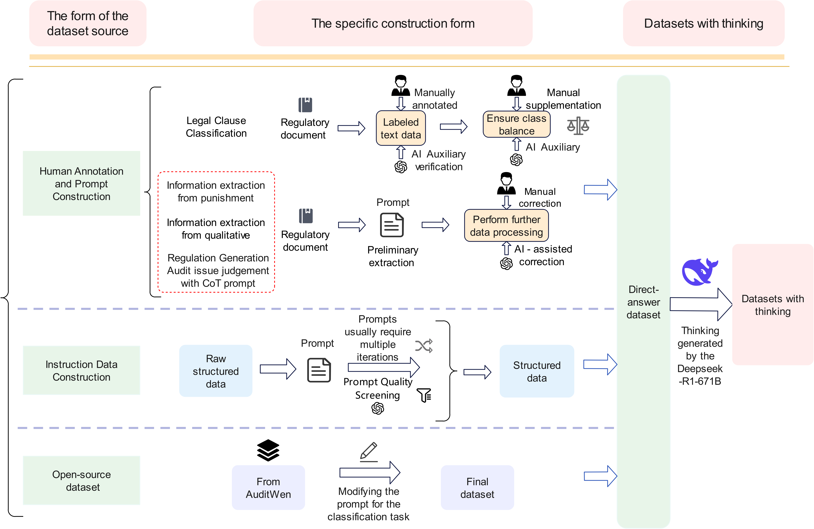
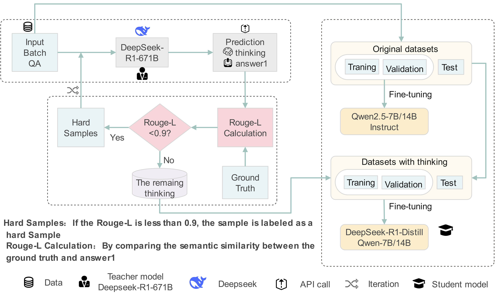

# AuditJudgLLM: A Domain-Specific Large Language Model and Benchmark for Evaluating Audit Judgment

## Project Introduction

This project focuses on data distillation and Large Language Model (LLM) fine-tuning in the audit domain. It generates high-quality reasoning data and performs fine-tuning using a Teacher-Student model framework, followed by systematic evaluation and testing of the model.

**Project Type:** Audit-specific data distillation and LLM fine-tuning.

**Main Features:**
- Dataset generation scripts.
- Answer extraction after the reasoning process.
- Multi-task evaluation scripts (Generative, Classification, Extraction).
- Data quality evaluation based on ROUGE-L.

---

## 📊 Project Architecture

Framework for Audit Finding Problem Judgment:

<p align="center">Figure 1: Audit-Finding-Problem Judgment</p>

Dataset Construction Process:

<p align="center">Figure 2: Dataset Preparation Process</p>

Reasoning Distillation Dataset Construction:

<p align="center">Figure 3: Flowchart of the Reasoning Distillation Dataset Construction Process</p>

---

## 🚀 Quick Start

### 2.1 Obtaining Rationales

Use the following template as input to the Teacher Model to generate structured reasoning processes:

```python
prompt_template = (
    f"针对问题：'{question}'，生成完整且清晰的推理过程，确保最终答案与'{my_answer}'严格一致。推理过程需包含以下部分：\n"
    f"---\n"
    f"**1. 问题分析：**\n"
    f"- 简要分析问题的核心内容，明确需要解决的关键点，包括任务要求的各个部分。\n"
    f"\n"
    f"**2. 推理步骤：**\n"
    f"- **步骤 1**：识别问题的背景和任务要求，明确审计问题的表现形式。\n"
    f"- **步骤 2**：根据表现形式，分析可能适用的法律法规，聚焦定性依据。\n"
    f"- **步骤 3**：基于定性结果，确定处理处罚依据（若适用）。\n"
    f"- **步骤 4**：验证推理结果与预期答案'{my_answer}'的一致性，调整格式或内容。\n"
    f"\n"
    f"**3. 最终答案（严格要求）：**\n"
    f"- 必须严格等于预期答案：'{my_answer}'，包括标点和用词。\n"
    f"- 直接输出答案，无额外解释。\n"
    f"---\n"
    f"⚠️ 注意：\n"
    f"- 必须完整写出问题分析和至少 4个推理步骤，不能跳跃。\n"
    f"- 严格按照上述格式，确保逻辑详细且连贯。\n"
)
```

Workflow:

1.The Teacher Model generates the reasoning process based on the question and the standard answer.

2.Extract the answer following the reasoning process.

3.Calculate the ROUGE-L score between the extracted answer and the Ground Truth.

4.Filter high-quality reasoning data based on the quality score.

Notes:

⚠️ The prompt templates for dataset construction vary for different task types.

---

### 2.2 JSON Files Generation

#### 2.2.1 Distillation Training Data

Taking a classification task as an example, the generated JSON data structure is as follows:

| Field                            | Content                                                                                                                                                                                                                                                                                                                                                                                      |
|----------------------------------|----------------------------------------------------------------------------------------------------------------------------------------------------------------------------------------------------------------------------------------------------------------------------------------------------------------------------------------------------------------------------------------------|
| **input**                        | 下面是一个分类任务，你需要判断下列法律条款属于哪一类，并从【"罚则"，"法律当中应当做的行为"，"法律禁止做的行为"，"规定"】选择一个类别。该问题的分类逻辑如下：<br><br>"罚则"：指法律、法规或其他规范性文件中规定的，对违反特定法律义务或禁止性规定的行为所应承担的法律责任和处罚措施。<br>"法律当中应当做的行为"：指法律明确规定要求公民、法人或其他组织必须履行的行为或义务。<br>"法律禁止做的行为"：指法律明确规定不允许公民、法人或其他组织从事的行为。<br>"规定"：指的是法律、法规、规章以及其他规范性文件中对特定事项所作出的具体要求或指示。这些规定可以是强制性的，也可以是指导性的，旨在明确各方的权利、义务以及行为准则。<br><br>法律条款：禁止医疗废物处置单位将使用后的核酸检测试管直接混入生活垃圾处理系统。<br><br>回答: |
| **content**                      | 法律禁止做的行为                                                                                                                                                                                                                                                                                                                                                                                     |
| **reasoning_content**            | 推理过程：<br>1. **识别关键词**：条款中的核心动词为"禁止"，明确表示不允许特定行为。<br>2. **比对分类定义**：<br>   - "法律禁止做的行为"对应法律中明令不允许实施的行为，"禁止"一词直接符合该类别特征。<br>   - 其他类别（如"罚则"涉及处罚措施，"应当做"强调义务，"规定"为一般性要求）均不契合条款的直接表述。<br>3. **结论**：因条款通过"禁止"明确限制某行为，属于对行为的直接禁令。<br><br>答案：法律禁止做的行为                                                                                                                                                |
| **repo_name**                    | Classification task                                                                                                                                                                                                                                                                                                                                                                          |
| **prompt_tokens_len**            | 200                                                                                                                                                                                                                                                                                                                                                                                          |
| **content_tokens_len**           | 4                                                                                                                                                                                                                                                                                                                                                                                            |
| **reasoning_content_tokens_len** | 135                                                                                                                                                                                                                                                                                                                                                                                          |

```json
{
  "input": "下面是一个分类任务，你需要判断下列法律条款属于哪一类...",
  "content": "法律禁止做的行为",
  "reasoning_content": "推理过程：\n1. **识别关键词**：条款中的核心动词为"禁止"...",
  "repo_name": "Classification task",
  "prompt_tokens_len": 200,
  "content_tokens_len": 4,
  "reasoning_content_tokens_len": 135
}
```

---

#### 2.2.2 Non-Distillation Training Data

Standard instruction fine-tuning format:

| Field  | Content                                                                                                                                                                                                                                                                                                                                                                                      |
|------|----------------------------------------------------------------------------------------------------------------------------------------------------------------------------------------------------------------------------------------------------------------------------------------------------------------------------------------------------------------------------------------------|
| **instruction** | 下面是一个分类任务，你需要判断下列法律条款属于哪一类，并从【"罚则"，"法律当中应当做的行为"，"法律禁止做的行为"，"规定"】选择一个类别。该问题的分类逻辑如下：<br><br>"罚则"：指法律、法规或其他规范性文件中规定的，对违反特定法律义务或禁止性规定的行为所应承担的法律责任和处罚措施。<br>"法律当中应当做的行为"：指法律明确规定要求公民、法人或其他组织必须履行的行为或义务。<br>"法律禁止做的行为"：指法律明确规定不允许公民、法人或其他组织从事的行为。<br>"规定"：指的是法律、法规、规章以及其他规范性文件中对特定事项所作出的具体要求或指示。这些规定可以是强制性的，也可以是指导性的，旨在明确各方的权利、义务以及行为准则。<br><br>法律条款：禁止医疗废物处置单位将使用后的核酸检测试管直接混入生活垃圾处理系统。<br><br>回答: |
| **input** | ""                                                                                                                                                                                                                                                                                                                                                                                           |
| **output** | 法律禁止做的行为                                                                                                                                                                                                                                                                                                                                                                                     |
| **system** | ""                                                                                                                                                                                                                                                                                                                                                                                           |
| **history** | ""                                                                                                                                                                                                                                                                                                                                                                                           |

```json
{
  "instruction": "下面是一个分类任务，你需要判断下列法律条款属于哪一类...",
  "input": "",
  "output": "法律禁止做的行为",
  "system": "",
  "history": ""
}
```

---

## 📦 Requirements
```
torch==2.5.0+cu118
torchaudio==2.5.0+cu118
torchvision==0.20.0+cu118
transformers==4.52.4
```


